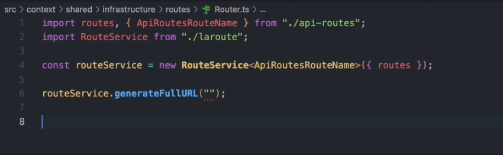

# Laroute

[](https://github.com/vaened/laroute/actions?query=workflow:Tests) [](license)

`vaened\laroute` is a PHP library inspired by [aaronlord/laroute](https://github.com/aaronlord/laroute), designed to help Laravel developers
manage their application’s routes in `JavaScript` without the need to hardcode `URLs`. This library goes a step further by introducing
modular routing, allowing you to separate routes based on URL patterns into different modules. Each module generates its own routes file,
making it easier to manage and scale your application’s routing structure.

<a href="#">
    
</a>

## Installation

Laroute requires PHP 8.2. To get the latest version, simply require the project using Composer:

```bash
composer require vaened/laroute
```

Publish the configuration file.

```bash
php artisan vendor:publish --tag='laroute'
```

Now, generate the routes based on your configuration and export the JavaScript service.

```bash
php artisan laroute:generate
```

## Usage

The library includes the necessary `javascript` service to interpret the exported routes, along with its corresponding `d.ts` type
definitions
for `typescript`.

> The location of the service is configured in the library option within the configuration file.

### Javascript / Typescript

Once the service is exported to the location defined in the configuration file, you can easily create a new file and export the service
creation by passing the file containing the routes as a parameter.

```typescript
import {RouteService} from "./laroute";
import routes from "./api-routes.json";

const apiRouteService = new RouteService({routes});
```

With this, you’re ready to start.

```typescript
const response = await fetch(apiRouteService.generateFullURL('store.products.lists'))
const data = response.json();
console.log(data)
```

Additionally, you can export the routes as a TypeScript file to enable route autocompletion in your editor. To achieve this, simply modify
the `output` option in the configuration file.

<a href="#" s>  
      
</a>

### Service

The route service provides three key methods to interact with the generated routes:

- **generateFullURL(name, ?params)**: Generates a full URL, including any query string parameters.

```typescript
apiRouteService.generateFullURL('admin.products.create', {
    id: '80768395-4208-4fd7-ac60-c429717014ab',
    name: 'Notebook'
})
```

> Returns `{host}/api/admin/products/80768395-4208-4fd7-ac60-c429717014ab?name=Notebook`

- **createURLWithoutQuery(name, ?params)**:Generates a full URL without any query string.

```typescript
apiRouteService.createURLWithoutQuery('admin.products.update', {
    id: '80768395-4208-4fd7-ac60-c429717014ab',
    name: 'Notebook'
})
```

> Returns `{host}/api/admin/products/80768395-4208-4fd7-ac60-c429717014ab`

- **has(name)**: Checks if a specific route is defined within the service.

```typescript
apiRouteService.has('admin.products.list')
```

> Returns `true` if the route exists, `false` otherwise.

### Best Practices

To efficiently manage API calls, it’s advisable to create a dedicated file. You might name it `Router.{ts, js}`. In this file, you can
utilize `fetch` or a library like `axios` to streamline your API interactions. An example of what you might export could look like this:

```typescript
import createRouteService, {Parameters} from "./laroute";
import axios, {AxiosRequestConfig, AxiosResponse} from "axios";
import api from "./api.json";

const apiRouteService = createRouteService(api);

export const Router = {
    get(routeName: string, params: Parameters = {}, config: AxiosRequestConfig = {}) {
        return axios.get(apiRouteService.cleanURI(routeName, params), {params, ...config});
    },

    post(routeName: string, params: Parameters = {}, config: AxiosRequestConfig = {}) {
        return axios.post(apiRouteService.cleanURI(routeName, params), params, config);
    },

    patch(routeName: string, params: Parameters = {}, config: AxiosRequestConfig = {}) {
        return axios.patch(apiRouteService.cleanURI(routeName, params), params, config);
    },
    // ...
};
```

## Configuration

The default configuration should be sufficient for most projects, allowing you to simply export the routes and start working without any
additional setup.

> For customization options, refer to the comments in the configuration file [laroute.php](./config/laroute.php).

### Advanced

For larger projects, where different clients consume the API, you can configure the route export in a modular way. This allows you to create
as many modules as needed, each corresponding to different URL segments.

For example, you could have a module for `/api/store` and another for `/api/admin`, which would generate two separate route files.

```php
'modules' => [
  [  
    'match'    => '/api/store',
    'name'     => 'store',
    'rootUrl'  => 'https://store.aplication.com',  
    'absolute' => true,
    'path'     => 'resources/routes',
  ],  
  [  
    'match'    => '/api/admin',
    'name'     => 'admin',
    'rootUrl'  => 'https://admin.aplication.com',
    'absolute' => true,
    'path'     => 'resources/routes',
  ],
]
```

## Features

- **Modular Routing**: Define and separate routes by modules based on URL patterns (e.g., /api, /admin, /user), with each module generating
  a separate JSON file.
- **Seamless Integration with Laravel**: Automatically generate JavaScript routes from your Laravel routes, ensuring consistency across your
  application.
- **TypeScript Support**: Includes a TypeScript-compatible JavaScript file, allowing you to use strongly-typed route definitions in your
  front-end code.
- **Customizable URLs**: Generate absolute or relative URLs with customizable prefixes and root URLs, giving you full control over how URLs
  are constructed.
- **Flexible Configuration**: Easily configure modules and route matching criteria to fit the needs of your project, whether it’s a
  monolithic application or a modular one.

## License

This library is licensed under the MIT License. For more information, please see the [`license`](./license) file.